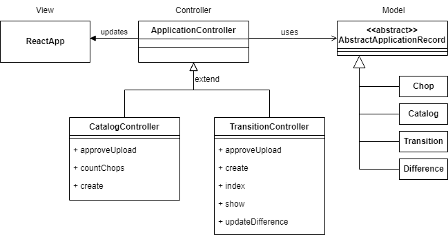
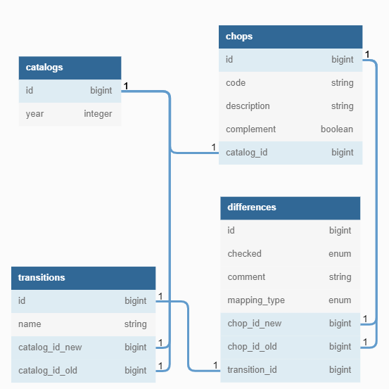
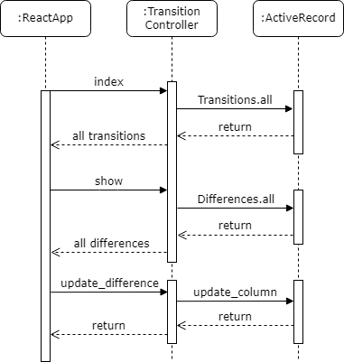

# Documentation

This project follows the standard Ruby on Rails Model-View-Controller (MVC) Pattern. Basic knowledge of this pattern is assumed.

Many boilerplate classes, which are generated by Rails, are left out in this UML-Classdiagram.


## View

We replace the whole view component with a React App. While it's possible to set up the view using Ruby, React is easier to work with. The Frontend is a *single-page* application and communicates with the backend with the *RESTful* Interface, primarily using ```GET```, ```POST``` and ```UPDATE``` calls.

## Controller

We have two subclasses of the ApplicationController, the base controller class.

The `catalogController` is responsible for everything concerning Catalogs and Chops.

* `approveUpload` validates if an incoming catalog is eligible to be inserted into the database
* `countChops` returns the amount of valid Chop-Codes in the database for a given year.
* `create` parses a catalog `.csv` and creates all Chop-Code entries in the database. This method should only be called if `approveUpload` returned Status Code `200`.

The `TransitionController` is responsible for everything concerning uploading a transition file and displaying differences between catalogs.

* `approveUpload` validates if an incoming transition file is eligible to be inserted into the database. For this, among other things, the two catalogs between the years should exist.
* `create` parses a transition `.xlsx` file. A difference is only created when there is an actual difference between catalogs. For this, we cross-reference the codes with the catalogs and check if `codable`, `title` or `code` changed.
* `index` returns all transition indices in the database.
* `show` lists all differences stored in the database for a given transition
* `updateDifference` updates the `comment` and `checked` column in the database.

## Model

The application depends on 2 core models, which use 2 intermediate tables to reference between the two . A `catalog`, which contains all the `chop` codes. And the `transition` table, which links between two catalogs and their `differences`.

For further documentation concerning the database, see the section about the [database](#database).

## Database

PostgresSQL is used as the DBMS. Ruby on Rails uses [Object-Relational-Mapping (ORM)](https://en.wikipedia.org/wiki/Object%E2%80%93relational_mapping) with [ActiveRecord](https://guides.rubyonrails.org/active_record_basics.html). All communication with the Database in this application is done with ActiveRecord.

The following schema represents our database schema. Note here how there are seperate columns for the foreign keys. These are necessary to implement relations between the tables e.g.
`1:n` for `catalogs <-> chops`.


The database is atleast in 3-Normalform, although it may very well be in Boyce-Codd-Normalform (not thoroughly checked), because there are almost no functional dependencies.

## Sequence Diagrams

There are two main workflows in this application
1. Uploading a transition file
2. Viewing all the differences

To better understand the architecture, the two following sequence diagrams should explain it a little bit.

### Transition Upload


Uploading a transition with a catalog consists of several steps. The User uploads a catalog and a transition in the React Frontend (Note: For simplicity, the `ReactApp` is thought of as one class, even though it consists of several components).
The User uploads a catalog and a transition file in the Browser. This sequence of events starts after the user clicked on "Dateien importieren" in the webapp:

1. `ReactApp` first asks if the uploaded catalog is valid for insertion into the database.
2. If it's valid, it sends the catalog to the `CatalogController` and the `CatalogController` parses and inserts the Catalog into the database. This is done using `ActiveRecord`. (Again, note here that `ActiveRecord` is reponsible for talking to the database)
3. If everything was successful, the same procedure happens with the transition. Note here aswell, that this procedure is simplified in this diagram. While calculating differences, the `TransitionController` is in constant communication with the database.  

### Viewing Differences


## See also

[Rubydoc](/doc/index.html) for documentation of all the classes